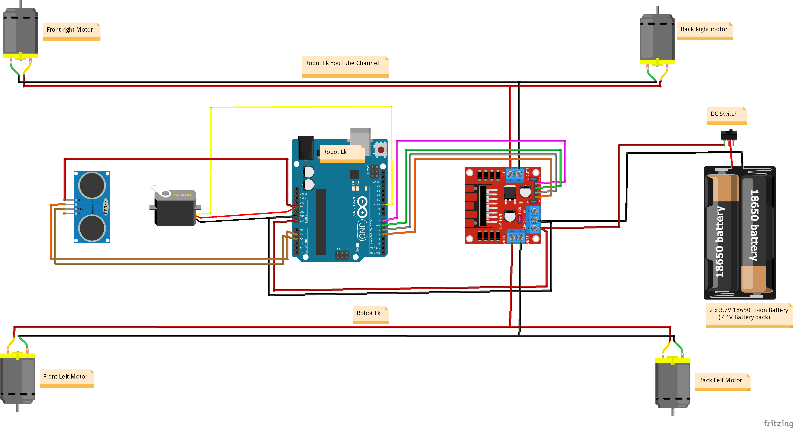
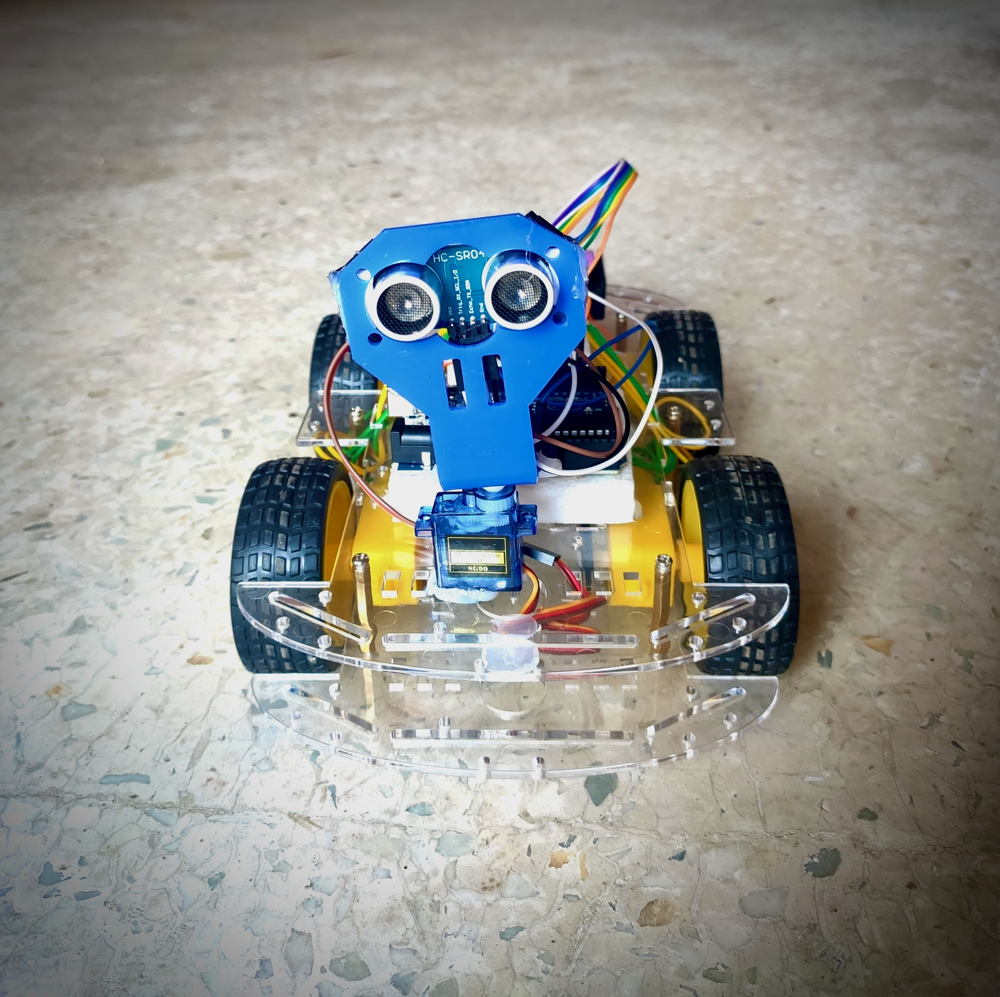
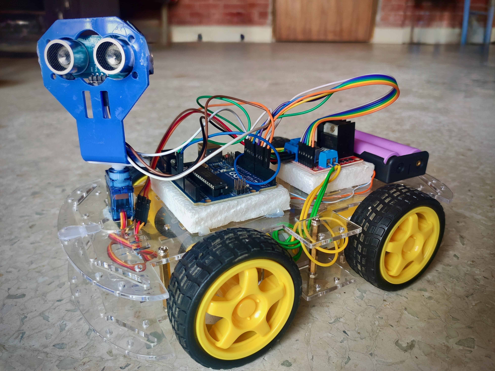

# 🚗 Smart Obstacle Avoiding Car (Arduino IoT Project)

An **IoT-based autonomous car** built with Arduino that can detect and avoid obstacles using an ultrasonic sensor.  
This project demonstrates how embedded systems and simple robotics can be used to achieve **autonomous navigation**.

---

## 📌 Features
- 🚘 Autonomous movement without manual control  
- 📡 Ultrasonic sensor for obstacle detection  
- 🔄 Automatic obstacle avoidance and rerouting  
- ⚡ Built using Arduino UNO, servo motor, and DC motors  
- 🔋 Portable and low-cost IoT prototype  

---

## 🛠 Components Used
- Arduino UNO (or compatible board)  
- Ultrasonic Sensor (HC-SR04)  
- Motor Driver (L298N or similar)  
- DC Motors with Wheels  
- Servo Motor (for sensor rotation, if used)  
- Power Supply (battery pack)  
- Chassis and jumper wires  

---

## 📂 Project Structure
- smart-obstacle-avoiding-car/
- │── code/                 # Your Arduino code
- │── images/               # Circuit diagram + demo photos
- │── README.md             # Documentation (with all sections inside it)

---

## 🔧 Circuit Diagram
// 

---

## 🚀 How It Works
1. The **ultrasonic sensor** continuously measures the distance from obstacles.  
2. If an obstacle is detected within a threshold distance (e.g., 15 cm):  
   - The car **stops moving forward**.  
   - The sensor (mounted on a servo, if used) rotates to scan left and right.  
   - The car chooses the path with more free space.  
3. The car **resumes forward motion** once the path is clear.

---

## 📸 Demo / Results

  
  

## ▶️ Getting Started

### 1. Clone the Repository
git clone https://github.com/choyon-sarker/smart-obstacle-avoiding-car.git
### 2. Open the Arduino Code
- Navigate to the `code/` folder.  
- Open the `.ino` file using the Arduino IDE.

### 3. Select Board & Port
- In Arduino IDE, go to **Tools → Board → Arduino UNO** (or compatible board).  
- Go to **Tools → Port** and select the COM port your Arduino is connected to.

### 4. Upload the Code
- Click the **Upload** button in Arduino IDE.  
- Wait until the code uploads successfully.

### 5. Run the Car
- Place the car on a flat surface.  
- Power it using a battery pack.  
- The car will start moving and automatically avoid obstacles.

### 6. Optional
- Modify parameters in the `.ino` file (like obstacle distance threshold) and re-upload to customize behavior.

---

## 📚 Applications
- Autonomous robotics  
- Smart vehicle navigation  
- IoT-based transport systems  
- Educational robotics projects

---

## ✨ Future Improvements
- Add Bluetooth/WiFi for remote monitoring  
- Mobile app for manual override  
- AI/ML for smarter path planning  
- Obstacle memory (map building)

---

## 👨‍💻 Author
**Choyon Sarker**  
📌 3rd Year IoT Project

---

## 📜 License
This project is licensed under the **MIT License**.  
Feel free to use and modify for educational purposes.
